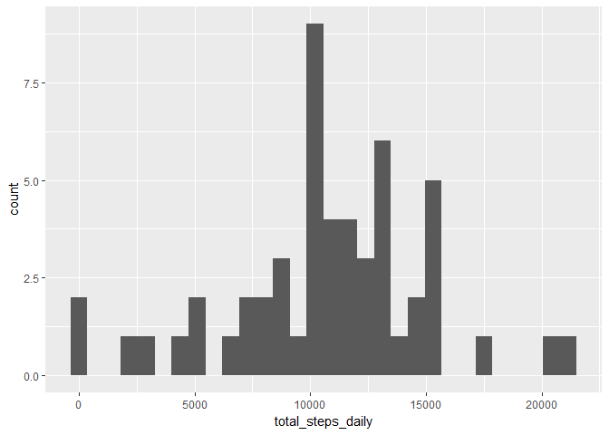
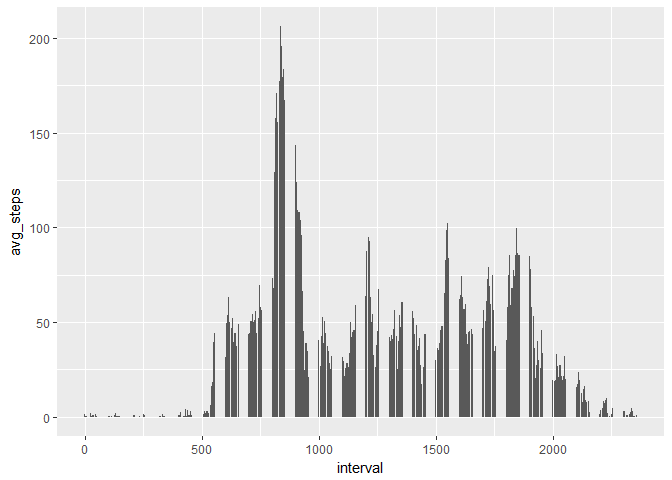
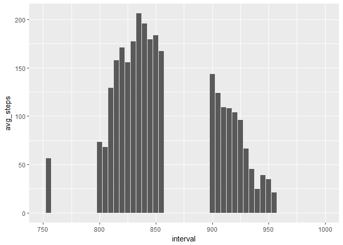
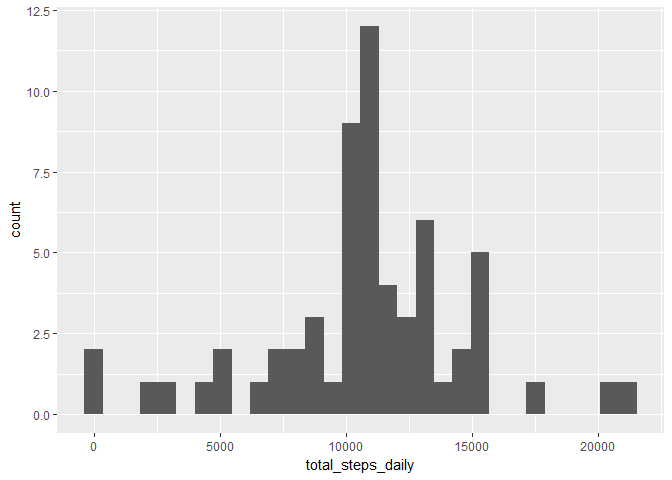
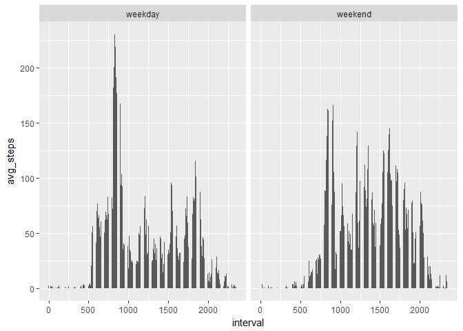

## Intro

Since this R markdown is for a peer-graded assignment, I am using echo = TRUE for all chunks of code as per the assignment instructions. In a research envinroment, I would create certain plots or load libraries without echoing the code chunks. 

## Packages Required

For this assignment I opted to use the following R packages: 

```r
library(readr)
library(dplyr)
```

```
## Warning: package 'dplyr' was built under R version 3.4.3
```

```
## 
## Attaching package: 'dplyr'
```

```
## The following objects are masked from 'package:stats':
## 
##     filter, lag
```

```
## The following objects are masked from 'package:base':
## 
##     intersect, setdiff, setequal, union
```

```r
library(ggplot2)
library(tidyr)
```

```
## Warning: package 'tidyr' was built under R version 3.4.4
```

## Importing Data

To get started, import the data using read_csv:

```r
raw_df <- read_csv('./activity.csv')
```

```
## Parsed with column specification:
## cols(
##   steps = col_integer(),
##   date = col_date(format = ""),
##   interval = col_integer()
## )
```

## Cleaning/Processing Data

### Question #1: Code for reading in the dataset and/or processing the data

Let's take a look at how many NAs are in the dataset before removing them: 

```r
sum(is.na(raw_df))
```

```
## [1] 2304
```

We can remove the observations w/ NAs by using na.omit():

```r
clean_df <- na.omit(raw_df)
clean_df$date <- as.factor(clean_df$date)
```

## Exploratory Analytics

### Question #2: Histogram of the total number of steps taken each day

Let's first use dplyr to aggregate the # of steps per day, then create a new variable called "total_steps_daily": 

```r
df_agg <- clean_df %>% 
  group_by(date) %>% 
  summarise(total_steps_daily = sum(steps))

#plotting the histogram
df_agg %>% ggplot(aes(total_steps_daily)) + geom_histogram() 
```

```
## `stat_bin()` using `bins = 30`. Pick better value with `binwidth`.
```

<!-- -->

### Question #3: Mean and median number of steps taken each day

We already aggregated this in the previous question, so let's just look at the mean/median using below. We'll also look at the total # of steps: 

```r
mean(df_agg$total_steps_daily)
```

```
## [1] 10766.19
```

```r
median(df_agg$total_steps_daily)
```

```
## [1] 10765
```

```r
sum(df_agg$total_steps_daily)
```

```
## [1] 570608
```

### Question #4: Time series plot of the average number of steps taken

For this plot, we need to aggregate by interval to create a time-series dataset. We can do this using dplyr. Note I opted to use a bar chart instead of a line to better view the time-series: 

```r
df_agg_ts <- clean_df %>% 
  group_by(interval) %>% 
  summarise(avg_steps = mean(steps))

df_agg_ts %>% ggplot(aes(interval, avg_steps)) + geom_bar(stat='identity')
```

<!-- -->

### Question #5: The 5-minute interval that, on average, contains the maximum number of steps

Looking at the time-series plot in the previous question, we see that the highest bar is somewhere in between intervals 750 and 1000. Let's replot the time-series and zoom in: 


```r
df_agg_ts %>% ggplot(aes(interval, avg_steps)) + geom_bar(stat='identity') + xlim(750,1000)
```

```
## Warning: Removed 261 rows containing missing values (position_stack).
```

<!-- -->

It looks like the interval is around 835. We can also confirm this w/ a simple dplyr command to find the maximum: 


```r
df_agg_ts %>% filter(avg_steps == max(avg_steps))
```

```
## Warning: package 'bindrcpp' was built under R version 3.4.4
```

```
## # A tibble: 1 x 2
##   interval avg_steps
##      <int>     <dbl>
## 1      835      206.
```

### Question #6: Code to describe and show a strategy for imputing missing data

Going back to our original "raw_df" dataframe which was the raw dataset read from the provided csv file, we can aggregate by interval, and replace the NAs with the mean steps for each 5-minute interval. We'll call the dataframe with imputed values "new_df": 


```r
new_df <- raw_df %>% 
  group_by(interval) %>% 
  mutate(steps = ifelse(is.na(steps), (mean(steps, na.rm=TRUE)), steps))
```

### Question #7: Histogram of the total number of steps taken each day after missing values are imputed

Basically same code as Question #2, except this time we reference "new_df" which has the imputed values instead. 


```r
new_df_agg <- new_df %>%
  group_by(date) %>% 
  summarise(total_steps_daily = sum(steps))

#histogram of total # of steps per day
new_df_agg %>% ggplot(aes(total_steps_daily)) + geom_histogram()
```

```
## `stat_bin()` using `bins = 30`. Pick better value with `binwidth`.
```

<!-- -->

Let's also take a look at how the imputed values affected the mean/median: *(also compare with Question #3)*


```r
mean(new_df_agg$total_steps_daily)
```

```
## [1] 10766.19
```

```r
median(new_df_agg$total_steps_daily)
```

```
## [1] 10766.19
```

```r
sum(new_df_agg$total_steps_daily)
```

```
## [1] 656737.5
```

Since I used the mean to impute missing values, the mean did not change significantly. *This is expected.* The median and total did change as a result of additional steps from imputing values.

### Question #8: Panel plot comparing the average number of steps taken per 5-minute interval across weekdays and weekends

We first need to categorize each day by weekday/weekend. Below creates this category as a new variable "day_type":


```r
new_df <- new_df %>%
  mutate(day_type = ifelse(weekdays(date)=='Sunday' | weekdays(date)=='Saturday',
                                        'weekend','weekday'))
```

With this new category, it is now an easy task to plot by weekdays/weekends:


```r
new_df %>% 
  group_by(interval, day_type) %>% 
  summarise(avg_steps = mean(steps)) %>%
  ggplot(aes(interval, avg_steps)) + geom_bar(stat='identity') + facet_wrap(~day_type)
```

<!-- -->

Again, I used a bar plot as I find it easier to view time-series as opposed to a line chart. What can we infer from the above plots?  
- there is a morning rush hour spike from intervals 800 to 930 on weekdays. The spike is less pronounced on the weekends  
- the distribution of steps over time is more even for weekends as opposed to weekdays (perhaps when more people are in the offices)  
- the activity from interval 2000 and later is higher on weekends than weekdays (perhaps people like to socialize later on the weekends)  

## Conclusion
Question #9 is self-explanatory and has been answered in the code chunks/writeup above. Thanks for reading/reviewing/grading my assignment. 
